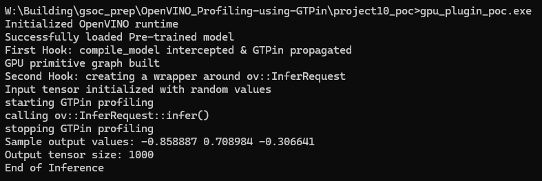

# Aim

To analyze the GPU execution flow and evaluate the feasibility of introducing a  `enable_gtpin` flag to control GTPin profiling. And to identify an ideal kernel profiling boundary during inference time.

# GPU Execution Flow

The flow of control starting from the OpenVINO runtime to the kernel launch can be summarized as follows:  

ov::Core::compile_model()  
ov::intel_gpu::Plugin::compile_model()  
ExecutionConfig  
ov::intel_gpu::CompiledModel  
Graph  
SyncInferRequest::infer()  
network::execute()  
primitive_inst::execute()  
primitive_impl::execute()  
stream.enqueue_kernel()  
OpenCL kernel launch 

The `Plugin::compile_model()` (compile time) and `SyncInferRequest::infer()` (inference time) are the primary locations of interest with respect to the given objectives.  

# Proposed Implementation Strategy

Upon observing the execution flow and noticing similar functionalities, I propose to implement the objectives in the following manner:  

### **1) Propagation of `enable_gtpin` flag**

**Location – `src/plugins/intel_gpu/src/plugin.cpp`**

- The `enable_gtpin` flag flows from the user input to `ov::compile_model` function and reaches `Plugin::compile_model` through the `AnyMap` parameter.  
- The flag can then be introduced as a GPU plugin property by defining it in `internal_properties.hpp`, and registering it with `ExecutionConfig.hpp` by adding the property to `options.inl`. This allows the enable_gtpin property to be accessed at runtime.
- The `ExecutionConfig` is then stored in the `CompiledModel` object and propagates into the `Graph` during graph construction.  
- Finally, the flag can be accessed inside `sync_infer_request` at runtime through the `ExecutionConfig` carried within the `Graph` object, this ensures that the flag can be used at inference time.  

### **2) Profiling boundary hook**

**Location – `src/plugins/intel_gpu/src/sync_infer_request.cpp`**

- After examining the kernel launch at different levels, I have identified that the individual kernel launch occurs at `stream.enqueue_kernel`.  
- However, this is not the ideal profiling boundary since GTPin instruments all kernels launched by an application at once. Setting up GTPin at individual kernel launches would add excessive overhead to the execution flow.  
- The profiling boundary should also have access to the `enable_gtpin` flag. Therefore I have identified `SyncInferRequest::infer()` as the ideal location to introduce GTPin, since it meets these conditions and sits at the core of each inference.  
- When the `enable_gtpin` flag is activated, the funtime tool can be used to start profiling before `enqueue()` and stop profiling after `wait()`, capturing details of all kernels launched during that inference. Individual kernel metrics can then be obtained using GTPin.  

# Simple Runtime Implementation

A conceptual version of the proposed idea at the public runtime level is implemented in  `gpu_plugin_poc.cpp`. I have simulated the actual implementation for `enable_gtpin`by using ov::Anymap.  

Currently, this program simulates the proposed execution flow as:  

This still operates at the public compile_model and infer level. However the true wrappers will be implemented within the plugin.cpp and sync_infer_request.cpp  

# Limitations

The proposed implementation does not support Asynchronous infer requests  

# Conclusion

Through this proposal I have identified the mechanism for introducing `enable_gtpin` and the ideal GTPin profiling boundary per inference. The proposed implementation aligns well with existing mechanisms and execution flow. I have also simulated the proposed ideas using a runtime level implementation.